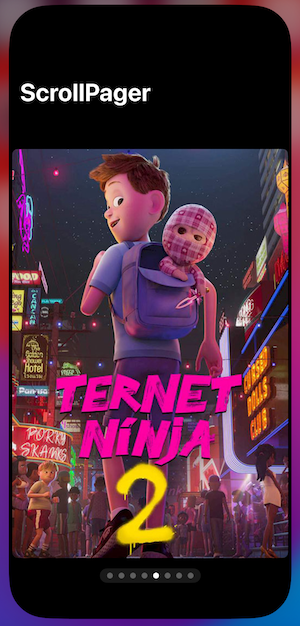

# ScrollPager
一个SwiftUI包，实现任意视图的分页滚动。


### 使用方式

```swift
import SwiftUI
import ScrollPager

struct ContentView: View {
    private let images: [String] = (0...7).map { "m\($0)" }
    @State private var currentIndex = 0
    
    var body: some View {
        NavigationStack {
            PagingScrollView(items: images, selection: $currentIndex) { item in
                Image(item)
                    .resizable()
                    .scaledToFit()
                    .cornerRadius(8)
                    .padding(.horizontal, 5)
            }
            .overlay(alignment: .bottom) {
                indicators
            }
            .navigationTitle("ScrollPager")
        }
    }
    
    // 分页指示器
    private var indicators: some View {
        HStack {
            ForEach(images.indices, id: \.self) { index in
                Circle()
                    .fill(currentIndex == index ? .white : .white.opacity(0.3))
                    .frame(width: 8, height: 8)
                    .onTapGesture {
                        currentIndex = index
                    }
            }
        }
        .frame(height: 8)
        .padding(.horizontal, 10)
        .padding(.vertical, 6)
        .background(.white.opacity(0.1))
        .clipShape(.capsule)
        .padding(.bottom)
    }
}

#Preview {
    ContentView()
        .preferredColorScheme(.dark)
}
```

### 预览



